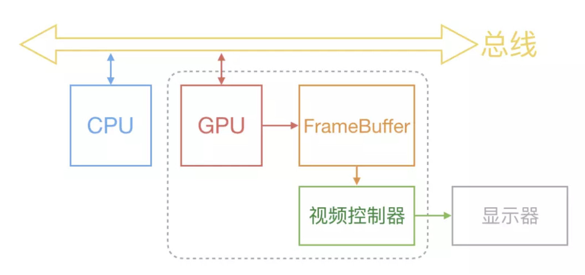

# YYImage

YYImage是一个强大的图像框架, 支持高效的动图显示.

 - 支持WebP, APNG, GIF动画图像的编码/解码/播放
 - 支持WebP, PNG, GIF, JPEG, JP2, TIFF, BMP, ICO, ICNS静态图像的编码/解码/显示
 - 支持PNG, GIF, JPEG, BMP图像的渐进式/逐行扫描/隔行扫描解码
 - 支持帧动画播放, 支持单张图片sprite sheet动画
 - 高效的动态内存缓存管理, 高性能低内存的动画播放
 - 预留可扩展接口, 支持自定义动画

## 一. 图片被渲染到屏幕的过程

在开始看YYImage如何处理高性能图片之前, 先来大致了解一下图片是如何被渲染到屏幕上的, 这部分内容是笔者自己的粗浅理解.

1. 通过`imageNamed:`等方法读取图片数据
2. 生成`imageView`, 将图片数据赋值给`imageView`, 将图片数据解码为位图数据(耗时操作)
3. CPU将位图数据通过总线传递给GPU
4. GPU通过顶点着色器和片元着色器等渲染图片

在上述过程中, 解压缩图片是非常耗时的, 为什么需要对图片进行解码呢?

GPU渲染图片需要图片的原始数据, 可以理解为位图, 是使用像素矩阵来表示的图像, GPU通过拿到像素矩阵, 根据矩阵中的像素色值来渲染图片, 当一张为解码的图片需要显示到屏幕上时, 需要先对图片进行解压缩操作, 才能显示.

## 二. iOS中显示图片的优化

`imageNamed:`和`imageWithData:`区别?

使用`imageNamed:`创建`UIImage`时, 会先在系统缓存中根据文件名称查找缓存, 返回最适合屏幕显示的`image`对象. 如果缓存中没有对应的`image`对象, 就会在资源文件中查找根据文件名, 并将文件名放到`UIImage`中返回, 这时并没有对实际的文件进行读取和解码. 当`UIImage`第一次被显示到屏幕上的时候, 才真正开始解码, 同时解码的结果会保存到一个全局缓存中. (系统缓存中保存的是解码以后的图片)

`imageWithData:`也是第一次显示的时候才会解码, 解码数据会缓存到image对象内部, 但是不会将image缓存到全局缓存中, 当image被释放的时候, image内部的缓存数据也会被释放掉.

`imageNamed:`会对图片进行缓存, 适合小并且使用频率高的图片.

`imageWithData:`不会对图片缓存, 适合大并且使用频率低的图片.

了解了图片渲染到屏幕的过程和`imageNamed:`方法, 在显示图片时可以从哪些方面进行优化呢?

`imageNamed:`方法在图片第一次被显示到屏幕上的时候才会解码图片, 这时是在主线程执行的显示图片, 而解码图片是非常耗时的. 可以在子线程中将图片进项强制提前解压, 将图片解压成位图数据,  使用`CoreGraphics`中的`CGBitmapContextCreate`方法实现.

`YYImage`就是使用这种方式, 将图片提前在子线程强制解压, 缓解主线程的压力.

## YYImage架构

分析YYImage的结构思想和设计思路 以及阅读源码时的实现细节探究分享, 不逐句翻译源码.

播放: 动图 帧动画 sprite sheet动画

图片解码方式: 解码单帧图片, 渐进式图片解码

图片编码方式: 编码静态图 编码动态图

图片类型探测

YYImage YYFrameImage YYSpriteSheetImage: 通过YYImageCoder将data数据转换为Image, 通过`[[UIImage alloc] initWithData:data]`创建`UIImage`.

YYAnimatedImageView用于显示.

YYImageCoder用于底层编解码.NSData和UIImage之间

## 思考

1. 图片入是和被渲染到屏幕上的?
2. 图片格式区别
3. 图片的编码/解码
4. 高效动态内存缓存
5. 高性能低内存动画播放
6. NSProxy的使用

1. 为什么sb创建的imageView不能播放gif图, 为什么gif图放到Assets文件中不能播放?
2. 如何判断图片类型
3. 图片浏览器 边下载边显示图片 怎么处理
4. 设置图片的几种方式 imageName contentOfFile data
5. UIImage支持哪些类型的图像

NSRegularExpression

NS_DESIGNATED_INITIALIZER宏的使用

[apple-ImageIO](<https://developer.apple.com/documentation/imageio?language=objc>)是iOS底层实现的图片编解码库, 负责颜色管理和访问图像元数据.

## 参考文章

[ibireme-移动端图片格式调研](<https://blog.ibireme.com/2015/11/02/mobile_image_benchmark/>)

[ibireme-iOS 处理图片的一些小 Tip](<https://blog.ibireme.com/2015/11/02/ios_image_tips/>)

[ibireme-iOS保持界面流畅的技巧](<https://blog.ibireme.com/2015/11/12/smooth_user_interfaces_for_ios/>)

[apple-ImageIO](<https://developer.apple.com/documentation/imageio?language=objc>)

[apple-ImageIO Programming Guide](<https://developer.apple.com/library/archive/documentation/GraphicsImaging/Conceptual/ImageIOGuide/imageio_intro/ikpg_intro.html?language=objc#//apple_ref/doc/uid/TP40005462>)

[菠儿菜-打造高性能iOS图片浏览器](<https://www.jianshu.com/p/bffdb9f0036c>)

[iOS中图片解压缩到文件渲染到屏幕的过程](<https://juejin.im/post/5d6a0809f265da03de3b193a>)

Q:请问你是如何知道系统api的一些底层信息的呢？比如你知道UIImage 底层是调用 ImageIO 的 CGImageSourceCreateWithData() 方法，还有在界面优化那个篇中你提到calayer的内部实际是没有属性的，请问这些你是如何去知道并且确认的呢？

A: Instruments 查看调用栈、Symbolic Breakpoint、调试、查看 dump 出来的头文件和函数里列表、网上查资料、猜测等等

