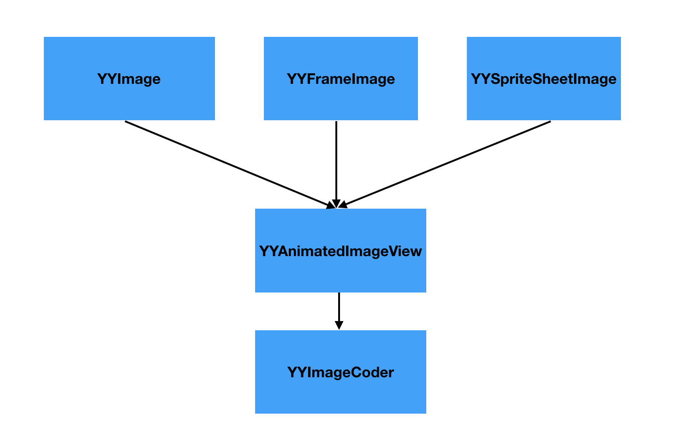

# YYImage

YYImage是一个强大的图像框架, 支持高效的动图显示.

 - 支持WebP, APNG, GIF动画图像的编码/解码/播放
 - 支持WebP, PNG, GIF, JPEG, JP2, TIFF, BMP, ICO, ICNS静态图像的编码/解码/显示
 - 支持PNG, GIF, JPEG, BMP图像的渐进式/逐行扫描/隔行扫描解码
 - 支持帧动画播放, 支持单张图片sprite sheet动画
 - 高效的动态内存缓存管理, 高性能低内存的动画播放
 - 预留可扩展接口, 支持自定义动画


## 一. 图片被渲染到屏幕的过程

在开始看YYImage如何处理高性能图片之前, 先来大致了解一下图片是如何被渲染到屏幕上的, 这部分内容是笔者自己的粗浅理解.


1. 通过`imageNamed:`等方法读取图片数据
2. 生成`imageView`, 将图片数据赋值给`imageView`, 将图片数据解码为位图数据(耗时操作)
3. CPU将位图数据通过总线传递给GPU
4. GPU通过顶点着色器和片元着色器等渲染图片

在上述过程中, 解压缩图片是非常耗时的, 为什么需要对图片进行解码呢?

GPU渲染图片需要图片的原始数据, 可以理解为位图, 是使用像素矩阵来表示的图像, GPU通过拿到像素矩阵, 根据矩阵中的像素色值来渲染图片, 当一张为解码的图片需要显示到屏幕上时, 需要先对图片进行解压缩操作, 才能显示.


## 二. iOS中显示图片的优化

`imageNamed:`和`imageWithData:`区别?

使用`imageNamed:`创建`UIImage`时, 会先在系统缓存中根据文件名称查找缓存, 返回最适合屏幕显示的`image`对象. 如果缓存中没有对应的`image`对象, 就会在资源文件中查找根据文件名, 并将文件名放到`UIImage`中返回, 这时并没有对实际的文件进行读取和解码. 当`UIImage`第一次被显示到屏幕上的时候, 才真正开始解码, 同时解码的结果会保存到一个系统缓存中. (系统缓存中保存的是解码以后的图片)

`imageWithData:`也是第一次显示的时候才会解码, 解码数据会缓存到image对象内部, 但是不会将image缓存到全局缓存中, 当image被释放的时候, image内部的缓存数据也会被释放掉.

`imageNamed:`会对图片进行全局缓存, 适合小并且使用频率高的图片.

`imageWithData:`不会对图片全局缓存, 适合大并且使用频率低的图片.


了解了图片渲染到屏幕的过程和`imageNamed:`方法, 在显示图片时可以从哪些方面进行优化呢?

`imageNamed:`方法在图片第一次被显示到屏幕上的时候才会解码图片, 这时是在主线程执行的显示图片, 而解码图片是非常耗时的. 可以在子线程中将图片进项强制提前解压, 将图片解压成位图数据,  使用`CoreGraphics`中的`CGBitmapContextCreate`方法实现.

`YYImage`就是使用这种方式, 将图片提前在子线程强制解压, 缓解主线程的压力.


## 三. YYImage架构

图像层: YYImage YYFrameImage YYSpriteSheetImage

展示层: YYAnimatedImageView

解码层: YYImageCoder

YYImage YYFrameImage YYSpriteSheetImage: 通过YYImageCoder将data数据转换为Image, 通过`[[UIImage alloc] initWithData:data]`创建`UIImage`, YYAnimatedImageView展示动图.


## 四. YYImage

`YYImage`是`UIImage`的子类, 对`UIImage`类的扩展以支持`WebP` `APNG` `GIF`格式图片解码.  并且遵循了`YYAnimatedImage`协议, 可以使用`YYImageVeiw`展示动画.

重写`imageNamed:`方法, 避免系统缓存.

```objc
+ (YYImage *)imageNamed:(NSString *)name {
	...
    NSArray *exts = ext.length > 0 ? @[ext] : @[@"", @"png", @"jpeg", @"jpg", @"gif", @"webp", @"apng"];
    NSArray *scales = _NSBundlePreferredScales();
    for (int s = 0; s < scales.count; s++) {
        scale = ((NSNumber *)scales[s]).floatValue;
        NSString *scaledName = _NSStringByAppendingNameScale(res, scale);
        for (NSString *e in exts) {
            path = [[NSBundle mainBundle] pathForResource:scaledName ofType:e];
            if (path) break;
        }
        if (path) break;
    }
    if (path.length == 0) return nil;
    
    // 根据path, 从Bundle中获取图片二进制数据
    NSData *data = [NSData dataWithContentsOfFile:path];
    if (data.length == 0) return nil;
    
    return [[self alloc] initWithData:data scale:scale];
}
```

- 在根据图片名称在Bundle中查找图片时, 如果指定了图片类型, 就按照指定的图片名称+后缀类型去查找图片, 如果未指定图片类型, 会遍历图片后缀类型查找, 所以为了减少遍历次数, 尽量指定图片后缀类型.

```objc
- (instancetype)initWithData:(NSData *)data scale:(CGFloat)scale {
    ...
    @autoreleasepool {
        YYImageDecoder *decoder = [YYImageDecoder decoderWithData:data scale:scale];
        YYImageFrame *frame = [decoder frameAtIndex:0 decodeForDisplay:YES];
        UIImage *image = frame.image;
        if (!image) return nil;
        self = [self initWithCGImage:image.CGImage scale:decoder.scale orientation:image.imageOrientation];
        if (!self) return nil;
        _animatedImageType = decoder.type;
        if (decoder.frameCount > 1) {
            _decoder = decoder;
            // 单帧数据占用内存 = 位图宽 * 位图高
            _bytesPerFrame = CGImageGetBytesPerRow(image.CGImage) * CGImageGetHeight(image.CGImage);
            // 占用总内存
            _animatedImageMemorySize = _bytesPerFrame * decoder.frameCount;
        }
        self.yy_isDecodedForDisplay = YES;
    }
    return self;
}
```

使用`YYImageDecoder`对data进行解码(解码相关内容会在`YYImageCoder`中提到),  image默认展示的是第一帧数据.


## 五. YYFrameImage

帧动画, 仅支持`PNG`和`JPEG`格式图片, 可以使用`YYImageView`显示帧动画, 内部遵循了`YYAnimatedImage`协议.

YYFrameImage中提供了4中初始化方法.

```objc
// 提供图片路径和每一帧持续时间
- (nullable instancetype)initWithImagePaths:(NSArray<NSString *> *)paths
                           oneFrameDuration:(NSTimeInterval)oneFrameDuration
                                  loopCount:(NSUInteger)loopCount;
// 提供图片数据和每一帧持续时间
- (nullable instancetype)initWithImageDataArray:(NSArray<NSData *> *)dataArray
                               oneFrameDuration:(NSTimeInterval)oneFrameDuration
                                      loopCount:(NSUInteger)loopCount;
```

YYFrameImage的职责就是将提供的图片路径或者图片数据数组通过`YYAnimatedImage`协议方法提供给`YYImageView`展示.


## 六. YYSpriteSheetImage

雪碧图: 将图片按照固定的间距排列在同一张大图上, 可以理解为按照rect和索引可以拿到大图中对应的各个小图.(把一个动画分解成多个动画帧, 按照顺序将这些动画帧排布在一张画布中, 播放动画时按照每一帧的尺寸大小和对应索引去画布中提取对应的帧显示, 达到动画的效果.)

使用雪碧图的目的: 相比对多张图片的加载和解压缩, 对一张大图的加载和解压缩的性能要高.

`YYSpriteSheetImage`是`UIImage`的子类, 同样也遵循了`YYAnimatedImage`协议, 在 `YYSpriteSheetImage`提供了每一帧图片在大图中的坐标位置.

```objc
- (CGRect)animatedImageContentsRectAtIndex:(NSUInteger)index {
    if (index >= _contentRects.count) return CGRectZero;
    return ((NSValue *)_contentRects[index]).CGRectValue;
}
```

`contentsRect`是`CALayer`的属性, 默认值是`[0, 0, 1, 1]`, 用法:

```objc
    YYSpriteSheetImage *sheet = ...;
    UIImageView *imageView = ...;
    imageView.image = sheet;
    imageView.layer.contentsRect = [sheet contentsRectForCALayerAtIndex:6];
```

设置`contentsRect`可以显示大图的某一块位置.


## 七. YYImageView

`YYImageView`是视图表现层, 用于展示`YYImage` `YYFrameImage` 和 `YYSpriteSheetImage` 动画.


### 1. YYAnimatedImage协议

`YYAnimatedImage` 提供了`YYImageView`显示动图需要实现的方法, `UIImage`的子类实现这些协议方法, 可以使用`YYImageVeiw`展示动图效果.

```objc
/// 动画总帧数
- (NSUInteger)animatedImageFrameCount;

/// 循环次数, 0表示不限制
- (NSUInteger)animatedImageLoopCount;

/// 在内存中每一帧的字节数, 在优化内存缓存时可能用到
- (NSUInteger)animatedImageBytesPerFrame;

/// 返回指定索引的帧图像, 可能在后台线程执行
- (nullable UIImage *)animatedImageFrameAtIndex:(NSUInteger)index;

/// 返回指定索引的图像显示时间
- (NSTimeInterval)animatedImageDurationAtIndex:(NSUInteger)index;

/// 这个是可选方法, 针对spriteSheet, 用于显示每一帧图像在spritesheet画布中的位置
- (CGRect)animatedImageContentsRectAtIndex:(NSUInteger)index;
```


### 2. YYAnimatedImageView

`YYAnimatedImageView` 从 `YYAnimatedImage` 协议中获取需要展示的图片信息, 进行动图展示.

思考: 动图展示的原理?

进行动图展示需要遍历总帧数(`animatedImageFrameCount`), 初始化定时器, 根据设置的动画执行时长(`animatedImageDurationAtIndex:`)切换`imageView`展示的图片(根据`animatedImageFrameAtIndex`获取).


#### 2.1 YYImageWeakProxy

YYImageWeakProxy持有target对象(弱引用), 因为在YYAnimatedImageView中有一个定时器会对target进行强引用, 这里使用Proxy打破循环引用.

NSProxy是一个抽象类, 如果要使用的话必须继承NSProxy(未提供init方法), 通常将消息转发给真实的target去处理,  通过`forwardInvocation:`和`methodSignatureForSelector:`方法转发给真实的target.

需要注意的是NSProxy接受到消息的时候: 直接进行转发

而普通对象: 查找本类->查找父类->动态解析->消息转发.

如果要消息转发的话, 相比来说NSProxy的性能更高.


#### 2.2 YYAnimatedImageViewFetchOperation

YYAnimatedImageViewFetchOperation是NSOperation的子类, 实现了main方法, 将需要执行的操作放在main方法中.

YYAnimatedImageViewFetchOperation主要是用于获取curImage对应nextIndex索引的图片, 并进行解压缩, 放入view对应的缓冲区(整个操作都是在子线程进行的)

在main方法中作者对operation进行了多次的isCancelled判断, 因为在operation有被取消的可能.

view的_incrBufferCount属性表示当前缓冲区中的缓存个数, 当缓冲区缓存个数为0时, 会自动在`calcMaxBufferCount`方法中为view分配最大缓存个数.

```objc
- (void)main {
	...
    for (int i = 0; i < max; i++, idx++) {
        @autoreleasepool {
            if (idx >= total) idx = 0;
            if ([self isCancelled]) break;
            __strong YYAnimatedImageView *view = _view;
            if (!view) break;
            LOCK_VIEW(BOOL miss = (view->_buffer[@(idx)] == nil));
            
            if (miss) {
                UIImage *img = [_curImage animatedImageFrameAtIndex:idx];
                img = img.yy_imageByDecoded;
                if ([self isCancelled]) break;
                LOCK_VIEW(view->_buffer[@(idx)] = img ? img : [NSNull null]);
                view = nil;
            }
        }
    }
}
```

先根据索引从view的缓冲区中查看缓存是否存在, 如果不在缓冲区, 将索引对应帧的图片进行解码, 并存放到view对应的缓冲区_buffer中, 供下次显示使用, 提高性能.

在操作view的_buffer缓冲区时, 为了保证多线程安全, 使用了线程锁

```objc
#define LOCK_VIEW(...) dispatch_semaphore_wait(view->_lock, DISPATCH_TIME_FOREVER); \
__VA_ARGS__; \
dispatch_semaphore_signal(view->_lock);
```


#### 2.3 YYAnimatedImageView

YYAnimatedImageView是UIImageView的子类, 通过重写`setImage:`等方法将图片设置到super.image中, 最后进行一些初始化的配置.

YYAnimatedImageView中使用CADisplayLink定时器做计时任务, 系统每一帧回调都会触发, 大约1/60s触发一次, 在`step:`方法中展示动画.

YYAnimatedImageView还是比较简单的, 搞清楚图片显示的流程, 代码读起来应该没什么难度.

```objc
- (void)step:(CADisplayLink *)link {
    // 当前显示图片
    UIImage <YYAnimatedImage> *image = _curAnimatedImage;
    // 缓冲区
    NSMutableDictionary *buffer = _buffer;
    UIImage *bufferedImage = nil;
    // 获取下一帧索引
    NSUInteger nextIndex = (_curIndex + 1) % _totalFrameCount;
    BOOL bufferIsFull = NO;
    
    if (!image) return;
    if (_loopEnd) { // view will keep in last frame
        [self stopAnimating];
        return;
    }
    
    // 处理时间
    NSTimeInterval delay = 0;
    if (!_bufferMiss) {
        // 如果当前定时器执行时长 < 图片的显示时间, 就没必要切换图片.
        _time += link.duration;
        delay = [image animatedImageDurationAtIndex:_curIndex];
        if (_time < delay) return;
        _time -= delay;
        if (nextIndex == 0) {
            _curLoop++;
            if (_curLoop >= _totalLoop && _totalLoop != 0) {
                _loopEnd = YES;
                [self stopAnimating];
                [self.layer setNeedsDisplay]; // let system call `displayLayer:` before runloop sleep
                return; // stop at last frame
            }
        }
        delay = [image animatedImageDurationAtIndex:nextIndex];
        if (_time > delay) _time = delay; // do not jump over frame
    }
    LOCK(
         // 从缓冲区获取显示图片
         bufferedImage = buffer[@(nextIndex)];
         if (bufferedImage) {
             if ((int)_incrBufferCount < _totalFrameCount) {
                 [buffer removeObjectForKey:@(nextIndex)];
             }
             [self willChangeValueForKey:@"currentAnimatedImageIndex"];
             _curIndex = nextIndex;
             [self didChangeValueForKey:@"currentAnimatedImageIndex"];
             _curFrame = bufferedImage == (id)[NSNull null] ? nil : bufferedImage;
             if (_curImageHasContentsRect) {
                 _curContentsRect = [image animatedImageContentsRectAtIndex:_curIndex];
                 [self setContentsRect:_curContentsRect forImage:_curFrame];
             }
             nextIndex = (_curIndex + 1) % _totalFrameCount;
             _bufferMiss = NO;
             if (buffer.count == _totalFrameCount) {
                 bufferIsFull = YES;
             }
         } else {
             _bufferMiss = YES;
         }
    )//LOCK
    
    // 重绘
    if (!_bufferMiss) {
        // 将需要显示的图片记录到_curFrame中, 调用系统的displayLayer:方法, 在displayLayer方法中设置layer.contents = (__bridge id)_curFrame.CGImage
        [self.layer setNeedsDisplay]; // let system call `displayLayer:` before runloop sleep
    }
    
    // 缓冲区未满, 并且当前操作队列为空, 就读取下一帧数据到缓冲区
    if (!bufferIsFull && _requestQueue.operationCount == 0) { // if some work not finished, wait for next opportunity
        _YYAnimatedImageViewFetchOperation *operation = [_YYAnimatedImageViewFetchOperation new];
        operation.view = self;
        operation.nextIndex = nextIndex;
        operation.curImage = image;
        [_requestQueue addOperation:operation];
    }
}
```

> 这部分是显示动图的核心代码, 所以直接将代码copy过来了, 在代码中做了相关的注释.


## 八. YYImageCoder

YYImageCoder是YYImage的底层编/解码实现.

在YYImageCoder中提供了UIImage的分类YYImageCoder, yy_imageByDecoded方法对图片进行解码.

解码的处理主要是在`YYCGImageCreateDecodedCopy`方法中

```objc
CGImageRef YYCGImageCreateDecodedCopy(CGImageRef imageRef, BOOL decodeForDisplay) {
    	...
	// 获取位图上下文
	CGContextRef context = CGBitmapContextCreate(NULL, width, height, 8, 0, YYCGColorSpaceGetDeviceRGB(), bitmapInfo);
    if (!context) return NULL;
    // 将图片绘制到上下文中, 解码图片
    CGContextDrawImage(context, CGRectMake(0, 0, width, height), imageRef); // decode
    // 通过上下文生成图片
    CGImageRef newImage = CGBitmapContextCreateImage(context);
    CFRelease(context);
    return newImage;
	...
}
```

解码处理逻辑:

1. 获取位图上下文
2. 将图片绘制到上下文中
3. 通过上下文生成图片


## 参考文章

[ibireme-移动端图片格式调研](<https://blog.ibireme.com/2015/11/02/mobile_image_benchmark/>)

[ibireme-iOS 处理图片的一些小 Tip](<https://blog.ibireme.com/2015/11/02/ios_image_tips/>)

[ibireme-iOS保持界面流畅的技巧](<https://blog.ibireme.com/2015/11/12/smooth_user_interfaces_for_ios/>)

[apple-ImageIO](<https://developer.apple.com/documentation/imageio?language=objc>)是iOS底层实现的图片编解码库, 负责颜色管理和访问图像元数据.

[apple-ImageIO Programming Guide](<https://developer.apple.com/library/archive/documentation/GraphicsImaging/Conceptual/ImageIOGuide/imageio_intro/ikpg_intro.html?language=objc#//apple_ref/doc/uid/TP40005462>)

[iOS中图片解压缩到文件渲染到屏幕的过程](<https://juejin.im/post/5d6a0809f265da03de3b193a>)

